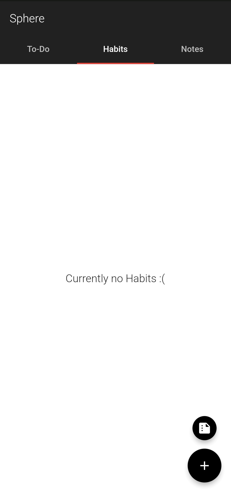

# Sphere - To-Do, Habits Tracker, Notes

• An Offline application that combines To-Do, Habits Tracker and Notes features in a Single App.

• Built using Flutter, Hive and FL_Charts.

To Download the app - https://github.com/nishanth1000/Sphere-Flutter/releases/download/v0.1.0/sphere.apk

## Features

• This application is a light-weight application which provide the functionalities of To-Do, Habits Tracker and Notes in a Single App.

• Navigation between these functionalities are made easy with a single swipe.

• This application is integrated with Hive Database to provide local storage for the User.

### Introduction Screen
• Introduction screens are designed and added into this application which gives a basic overview what this App does. These screens are displayed only once when the User opens the application for the first time.

### Hive Database
• Hive Database is used in this application to provide local storage for all data.

### FL_Charts
• FL_Charts is used to display the Line plot Graph in this application to represents the Habits Summary.

### Default Message
• At the first time of installation the App comes with the basic To-Do, Habits and Notes created by default. This is done only for the first time, because to make the User more familiar to the application.

• These can be removed by the User and never appears until the User creates the same one.

### Nothing Message
• When there is no To-Do, Habits or Notes to display the Application displays this Nothing message to indicate the User that there is no data to display.

### Edit Habits Name
• The Habits name can be edited if the User wishes to change the name of the Habit.

### Habits Summary
• The Habits are summarized using FL_Charts in which a Line Plot Graph is displayed. This Graph represents data for the current month. X-axis is the Days and Y-axis is the frequency that is total no of completion of Habits in that particular date.

• The Graph gets flushed and data gets reseted for every new month.

## Screenshots

### Introduction Screens
<pre>
   
</pre>

### To-Do Screens
<pre>
  
</pre>

### Habits Screens
<pre>
   
</pre>

<pre>
   
</pre>

### Notes Screens
<pre>
  
</pre>
